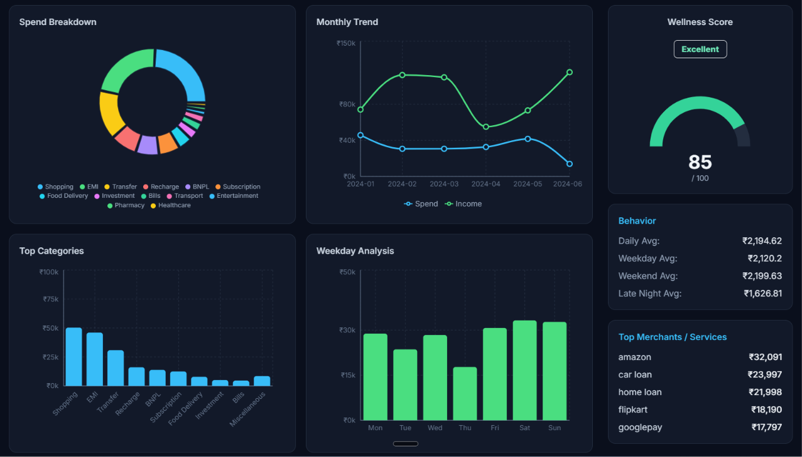

# MoneyOS

UPI Spend Analyzer and Personal Financial Health Mapper

<div align="center">
  
</div>

## Problem

Millions of users in India transact via UPI daily, but most have no visibility into their spending patterns. Bank statements are static CSV dumps that offer no insights. Users struggle to identify where their money is going, recurring subscriptions draining their accounts, overuse of BNPL services, food delivery expenses, and overall financial wellness.

## Solution

MoneyOS transforms raw UPI and bank statements into actionable financial intelligence without requiring AI or OCR. It provides automatic transaction categorization into 60+ categories, financial leak detection for subscriptions and BNPL usage, a wellness score from 0-100, personalized recommendations with estimated savings, and visual analytics with interactive charts.

## Architecture

```
MoneyOS/
├── app/                    # Next.js App Router
│   ├── page.tsx           # Dashboard UI
│   ├── layout.tsx         # Root layout
│   ├── globals.css        # Global styles
│   └── actions.ts         # Server actions for file processing
├── components/            # React components
│   ├── Charts.tsx         # Data visualizations
│   ├── KpiCards.tsx       # Financial KPIs
│   ├── LeakDetection.tsx  # Leak detection cards
│   ├── Recommendations.tsx # Savings recommendations
│   ├── WellnessGauge.tsx  # Financial health gauge
│   └── DownloadReportButton.tsx # PDF report export
├── lib/                   # Core logic
│   ├── parsers/           # CSV and PDF parsing
│   ├── categorizer/       # Transaction categorization engine
│   ├── analytics/         # Insights, scoring, leak detection
│   └── helpers.ts         # Utility functions
├── types/                 # TypeScript definitions
└── data/                  # Sample data for testing
```

## Features

**Smart Categorization**
Automatically classifies transactions into 14 categories including Food, Shopping, Transport, Bills, Healthcare, Entertainment, Travel, Subscriptions, BNPL, EMI, and Investments using keyword matching and fuzzy search.

**Financial Leak Detection**
Identifies money drains through recurring subscription payments, BNPL service overuse (Simpl, Lazypay, Zestmoney), and food delivery expense tracking (Swiggy, Zomato).

**Wellness Score**
Calculates a financial health score from 0 to 100 based on savings ratio, non-essential spending percentage, monthly balance consistency, and negative month frequency.

**Visual Analytics**
Interactive charts including spend breakdown by category, monthly income versus expenses trend, top spending categories comparison, and weekday spending pattern analysis.

**Personalized Recommendations**
AI-free deterministic suggestions with estimated monthly savings based on spending patterns and leak detection results.

## Tech Stack

- **Framework**: Next.js 14 with App Router
- **Language**: TypeScript
- **Styling**: Tailwind CSS
- **Charts**: Recharts
- **CSV Parsing**: PapaParse
- **PDF Parsing**: pdf-parse
- **Fuzzy Matching**: Fuse.js
- **PDF Export**: html2canvas, jspdf
- **Icons**: Lucide React
- **Backend**: Supabase (optional)

## Future Scope

- Multi-currency support for international transactions
- Investment portfolio tracking and analysis
- Budget setting with alerts and notifications
- Historical trend comparison across months
- Export to accounting software formats
- Mobile application for on-the-go access
- Bank API integration for automatic syncing


